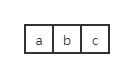
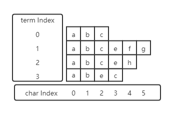
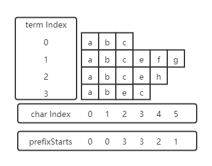

`FieldInvertState`用于记录倒排索引创建过程中需要保存的状态信息，一个FieldInvertState只记录每个Document中的一个字段的posting信息（如果多个同名的字段出现，则视为一个具有多值的字段），当处理一个新Document时，字段对应的FieldInvertState会被重置（reset）。


当一个字段的TokenStream生成后，需要使用这个TokenStream设置下FieldInvertState中的属性字段，通过这些字段可以获取每个Token的相关信息。包含的属性有：

- TermToBytesRefAttribute

  返回当前token对应的文本内容

- TermFrequencyAttribute

  返回当前token的频次，通常是1

- PositionIncrementAttribute

  返回当前token相对于前一个token的position增量

- OffsetAttribute

  返回当前token对应的单词在原始文本中的起始偏移量和结束偏移量

- PayloadAttribute

  返回当前token的额外信息


每个需要创建倒排索引的字段都会有一个FieldInvertState，用于记录字段中每个Token的信息，如下说明：

- **position**

  记录当前token在当前Document中的位置信息，TokenStream会携带一个类型为`PositionIncrementAttribute`的属性，这个属性返回当前token的相对于上一个token的position增量，因此初始状态下position字段为-1，如果第一个token返回的position增量为n的话，那么此token的position为(n - 1)，下一个token的增量为m的话，则其position为(n - 1 + m)，依次类推。当某个token有同义词时，这些同义词的增量为0，因此它们的position是相同的。position增量是大于等于0的整数，因此字段中token的position应该是递增的，FieldInvertState中有记录上一个token的position的变量lastPosition，用于和当前token的position进行比较来检验递增性。

  Lucene是允许一个Document中有多个相同的字段，等价于一个字段中有多个值，最终值可以看作一个按字段出现的先后顺序排序的值组成的数组。多个值会当做一个文本进行处理，文本解析还是一个值一个值的解析，但他们之间共享一个FieldInvertState，因此某个值中的token的position是在前一个值的最后一个token的position的基础上计算的。`Analyzer`中有个接口可以设置这些值的token之间间隔的position距离，默认为0，也就是把它们看作连续的文本，也可以把其设置为大于0的值，这个设置会影响到词组查询的结果。

- **numOverlap**

  用于记录position相同的token的个数，分词器可能会把一个单词的同义词添加到token流中，因此会出现多个token位于同一个position的情况，当出现position为0的token时，numOverlap就会加一。

- **offset**

  记录当前字段的相对偏移量。FieldInvertState中的`OffsetAttribute`属性会返回当前token的在文本中的起始偏移量和结束偏移量（就是token对应的单词在原始文本中的起始位置和结束位置）。当字段有多个值时，offset才有用，和position一样，多值情况下，当前值的文本是放置到前一个值的文本后面的，所以当前值的token的偏移量也要在前一个文本的结束偏移量的基础上计算，所以这个offset变量就是记录当前值的文本的起始偏移量。`Analyzer`中也有一个接口可以设置多值之间offset的间隔大小，默认是1，可以看作多个值的文本之间隔着一个空格符。偏移量应该也是递增的，所以FieldInvertState有个lastStartOffset变量用于保存前一个token的开始偏移量，和当前token的开始偏移量比较以检测递增性。

- **length**

  用于记录当前字段的文本包含的token数量，这个值可能大于原文本中的单词总数，如上所述，一个单词被分词器解析后可能对应多个token。FieldInvertState中的`TermFrequencyAttribute`属性返回当前token的频次，默认是1，length就是统计每个token的频次之和。

- **maxTermFrequency**

  记录字段中term的累计频次的最大值。

- **uniqueTermCount**

  记录字段中不同的token的个数。


当一个Token生成后，FieldInvertState会先通过token的信息更新自己的字段，然后调用`TermsHashPerField`的`add(BytesRef termBytes, int docID)`保存token的文本内容。

TermsHashPerField中维护了一个把term文本映射到termID的HashMap（自己实现的）。然后具有相同termID的token对应的posting信息会保存到一起，这些信息通过两个pool来存储：`IntBlockPool`与`ByteBlockPool`。


## 磁盘数据

`org.apache.lucene.codecs.blocktree.BlockTreeTermsWriter`

这个类有两个参数：minItemsInBlock和maxItemsInBlock。

minItemsInBlock限定能合并为block的term的最小数量；

maxItemsInBlock限定合并为block的term的最大数量。

它们需要满足如下关系：

`1 < minItemsInBlock < maxItemsInBlock < 2 * (minItemsInBlock - 1)`

注意到最后一个不等式：`maxItemsInBlock < 2 * (minItemsInBlock - 1)`，为什么需要满足这个条件呢？

原因需要聚焦到[方法](#Create Block)


`org.apache.lucene.codecs.lucene84.Lucene84PostingsWriter`

.doc文件保存term其所在的所有文档的docID和freq信息（每个doc中出现的次数信息），docID与freq分开存储。

.pos文件存储term在文档中的position信息。

.pay文件存储term在文档中的payload信息及offset信息。


- docStartFP、posStartFP、payStartFP

  把每个term的posting信息写入磁盘文件前都会先用这三个变量记录一下对应文件的起始写入位置，docStartFP是.doc文件的起始位置，posStartFP对应.pos文件，payStartFP对应.pay文件。

- lastDocID

  记录当前term的最近一次遍历到的docID

- 


`org.apache.lucene.codecs.blocktree.BlockTreeTermsWriter.TermsWriter`

### pushTerm

```java
// 1、每个term都会执行一次pushTerm
// 2、term是有序的
//
// 此函数的目的是选出共享前缀尽可能长的term进行合并，当然如果term数量太少，合并的意义也不大，因此需要对进行合并的term的最小数量
// 做限制，代码中最小数量通过变量minItemsInBlock获取。
private void pushTerm(BytesRef text) throws IOException {
    /*这个方法操作两个变量: pending和prefixStarts
      pending用于保存输入的term及term合并生成的block；
      prefixStarts保存和前缀有关的信息。
      
      步骤：
      1、获取text与上一个term（最后追加到pending的term，下面称为lastTerm）共享的前缀；
      2、如果共享前缀的长度小于lastTerm的长度，说明text终止了lastTerm中的部分共享前缀（即使这个共享
         前缀只在lastTerm中也算），假设text与lastTerm的共享前缀长度为prefixLength，那么lastTerm
         中被终止的共享前缀的数目为(lastTerm.size - prefixLength)。有一点需要明白，因为term是有序的，
         所以一旦某个前缀被终止了，那么之后也就不可能再出现具有这个前缀的term了，因此包含这些被终止的前缀的term
         已经全都存在penging列表中了。
      3、接下来开始检测具有这些前缀的term的数量有没有达到合并的条件（也就是数量大于minItemsInBlock）。为了保证
         共享的前缀尽可能长，所以从最长的被终止的前缀开始检测，直到最短的被终止的前缀，中间如果条件符合，则合并相应
         的term，这些被合并的term会被移除pending，并以一个block添加到pending中，短的前缀的合并是基于长的前缀
         的合并结果的基础上进行的。
      4、最后，用text更新prefixStarts。
      
      疑问：
      1. writeBlocks之后对prefixStarts的赋值是不是多此一举？因为prefixStarts的值将会被新term覆盖。
      2. 方法里获取prefixLength时调用了Arrays.mismatch方法，这个方法只有在输入的两个byte数组都为空时才会返
         回-1，这种情况只会在finish()方法中调用了两次pushTerm(new BytesRef())的时候才会发生，所有pushTerm
         函数中关于if (prefixLength == -1)的注释是不是在误导人？
      3. 问题2中提到了finish()中会调用两次push空字节数组的操作，第一次push的作用容易理解，目的是为了把pending
         中剩下entry进行合并，但第二次push的作用就没法理解了，按逻辑来说，这个push是一个什么都不会做的空操作，所
         有这一步是不是可以删除掉？
    */
}
```

**prefixStarts**

每个term都由字符组成（计算过程中按字节进行处理），例如"abc"由三个字符组成，表示为



现在输入四个term："abc", "abcefg", "abceh", "abec"，它们的字符看起来是这样的：



在这个例子中我们可以的到一些关于前缀的信息，其中共享前缀"a"和"ab"的term有4个（term index为[0, 3]），共享前缀"abc"的term有3个（term index为[0, 2]），共享"abce"的term有两个（term index为[1, 2]）。

为了记录上述信息，创建了一个名为prefixStarts的int数组，数组中index为i的元素保存了char index为i的字符最近一次发生变更的term index。

继续用上面的例子进行说明，上面最长的term有6个字符，所以prefixStarts的长度会不小于6。prefixStarts中第0个元素记录char index为0的字符最近一次发生更新term的index，例子中所有term的第0个字符都是'a'，所以prefixStarts[0]为0，同理prefixStarts[1]为0。char index为2的字符最新一次变更是由index为3的term触发的，所以prefixStarts[2]为3，依此类推，最终prefixStarts的值为：



最后，prefixStarts中的内容只对最后一个加入的term生效，上面例子中最后一个term的长度为4，所以prefixStarts中只有[0, 0, 3, 3]的内容是有效的。另外，因为term都是有序的，所以对于一个term而言，prefixStarts中的元素是递增的。


### Term Block

pending中的term满足一定条件后会被合并为一个block，block与term或block与block又可以再次合并为block

```java
// count是需要合并为block的term的个数
// prefixLength是这些term共享的前缀的长度
void writeBlocks(int prefixLength, int count) throws IOException {
    /*  
     *  共享前缀后面的第一个字符记为suffixLeadLabel（对于共享前缀就是term的情况，这个值为-1）。具有相同
     *  suffixLeadLabel的term的个数肯定是小于minItemsInBlock，不然（prefix + suffixLeadLabel）的
     *  前缀会先触发writeBlocks事件。
     *  把count个term进行分组，具有相同suffixLeadLabel的term为一组，一个组中的所有term会位于同一个block中，
     *  而一个block包含至少2个组的term。
     *  一个block中包含的term数量最多为maxItemsInBlock，而一组中的term数最多为(minItemsInBlock - 1)，因
     *  为一个block至少包含两个组，所有maxItemsInBlock <= 2 * (minItemsInBlock - 1)。之所以会限制block
     *  中entry的数量，是为了控制搜索term遍历entry的数量，如果太大，性能不行；但也不是越小越好，太小的话，block
     *  中保存的数据变少了，数据的压缩度变小，并且随着block数量变多，FST的中存储的内容也多了。
     *  当count <= maxItemsInBlock时，所有的term合并为一个block；否则，在剩余term数大于maxItemsInBlock
     *  的条件下，依次选取连续的其term数之和超过minItemsInBlock的最小数量的组合并为一个block。如果生成多个block，
     *  这些block的isFloor属性都是true，表示prefix下的entry被分到多个block中了。它们中只有第一个block会被FST
     *  索引，其他block的信息可以通过第一个block的索引信息算出。并且只有第一个block会被添加到pending中参与上层block
     *  的创建。
     *  每个block的数据都会被存储到.tim文件中。
     *  如果当前block中有block entry，则当前block中会保存entry block的开始位置，相当于有这个entry block的引用，
     *  这个引用的作用是做模糊查找时可以直接调整到block entry中进行term的搜索。如果是精确查找，则FST可以直接定位到term
     *  可能存在的block（如果block的isFloor为true，则是定位到多个block）。
     */ 
}
```


# File Format

## .doc

```yaml
file:
  header
  byte_order
  term1_data
  term2_data
  ...
  termN_data
  footer
  
byte_order: 'B' | 'L'

termN_data:
  docIDDeltaBlock_1
  [docTermFreqBlock_1]
  docIDDeltaBlock_2
  [docTermFreqBlock_2]
  ...
  docIDDeltaBlock_N
  [docTermFreqBlock_N]
  [tail_data]
  [skip_data]

tail_data:
  | docDeltaList
  | docDelta_FreqList

docDeltaList:
  docDelta1_VInt
  docDelta2_VInt
  ...
  docDeltaN_VInt

docDelta_FreqList:
  docDelta_Freq_1
  docDelta_Freq_2
  ...
  docDelta_Freq_N

docDelta_Freq_N:
  | (docDeltaN << 1 || 1)
  | (docDeltaN << 1)
    freq

skip_data:
  levelN_data_length
  levelN_data
  ...
  level1_data_length
  level1_data
  level0_data
```

`byte_order`：记录存储时用的字节序，B表示大端，L表示小端。

`termN_data`：每个term会有一个termN_data，内部主要内容为包含此term的document的ID列表，以及此term在每个document中出现的次数（freq）。ID和freq都是用整数表示，所有存储时会使用bit-packing和VInt等方式进行压缩存储，因为bit-packing的每个block存储128个整数，所有当数字个数大于128时，每128个数字通过bit-packing进行存储，不足128的部分采用VInt的方式逐个存储（也即文件格式中的tail_data）。

`tail_data`：ID和freq的个数不一定是128的整数倍，所有末尾可能会有个数不足128的数据，这些数据采用VInt的方式存储，如果没有freq数据，则只存储DocID的数据；如果有freq数据，则在存储docID时空出一位用来表示freq是否为1，如果freq是1，则空出的位存储1，然后不再单独存储freq；如果freq大于1，则空出位存储0，然后再单独存储freq（见docDelta_Freq_N）。

`skip_data`：内存中skip list是对链表的一种索引，用于实现快速的链表查询，Lucene中它被用来快速查找term的posting信息。SkipList有层级关系，在Lucene的实现中，第0层会为每个docID的block添加一个skip point，0层以上的skip list会为其下一层的每8个point创建一个skip point。每层中的数据都可以看作一个保存若干个skip point的List，每个skip point的数据结构是一样的，包含如下信息：

```yaml
skip point:
  docIDDelta
  docIDFilePointerDelta
  [posFilePointerDelta]
  [curPosBufferUpto]
  [curPayloadByteUpto]
  [payFilePointerDelta]
  [freqNorm]
```

`docIDDelta`：一个skip point有一个curDocID，它表示skip point指向的docID block中保存的最后一个docID，docIDDelta则表示当前point的curDocID与前一个point的 curDocID的差值（docID是升序的，所有这个值肯定是大于0的）。如果此point是第一个point，则直接存储curDocID。

`docIDFilePointerDelta`：skip point的curDocPointer是此point对应的docID block在.doc文件中的结束偏移量（也就是下一个block开始的位置）。docIDFilePointerDelta是此point的curDocPointer与前一个point的curDocPointer的差值。第一个point的docIDFilePointerDelta为其curDocPointer与term在.doc文件的起始偏移量的差值。

`posFilePointerDelta`、`payFilePointerDelta`、`curPosBufferUpto`和`curPayloadByteUpto`：一个term在一个document中可能会出现多次，所以一个docID可能对应多个position，在生成skip point时，docID恰好生成了一个block，但position却不一定（payload和offset同理），所以为了记录skip point的curDocID包含的最后一个position的结束位置，需要当前.pos文件的写入偏移量（对于payload和offset而言是.pay文件的偏移量），以及内存数组中已经保存的position的个数（curPosBufferUpto， payload和offset的个数与position相同）。另外payload有byte数组，所有需要存储curPayloadByteUpto用于记录内存中存储的payload的字节长度。

posFilePointerDelta是当前point的posFilePointer与前一个point的差值，而payFilePointerDelta是当前point的payFilePointer与前一个point的差值。


## .pos

```yaml
file:
  header
  term1_data
  term2_data
  ...
  termN_data
  footer

termN_data:
  pos_block_1
  pos_block_2
  ...
  pos_block_N
  tail_data

tail_data:
  pos_1
  [payload_1]
  [offsets_1]
  pos_2
  [payload_2]
  [offsets_2]
  ...
  pos_N
  [payload_N]
  [offsets_N]
```

pos文件主要存储block组织的position信息（pos_block_N），以及无法组织为block（个数小于BLOCK_SIZE，即128）的position、payload和offset信息（tail_data）。

`tail_data`：这部分数据保存最后不足一个BLOCK_SIZE(128)的position、payload和offset，数字部分均使用VInt存储。

如果需要存储payload信息，则position会左移一位，并用空出来的位表示当前的payload的长度是否和前一个payload的长度相同，如果相同则为0；如果不同则为1，并且position后面会跟着payload的长度信息。然后，如果payload的内容不为空的话，则存储payload的字节内容。

offset的存储也做了一个优化，startOffsetDelta左移了一位用于表示当前的offsetLength是否与前一个offsetLength相同，offsetLength是(endOffset - startOffset)的值。如果当前的offsetLength和前一个offsetLength相同的话，则空出的位为0；如果不同的话则为1，随后保存offsetLength的值。


## .pay

```yaml
file:
  header
  term1_pay_offset_block
  term2_pay_offset_block
  ...
  termN_pay_offset_block
  footer

termN_pay_offset_block:
  [payload_block_1]
  [offset_block_1]
  [payload_block_2]
  [offset_block_2]
  ...
  [payload_block_N]
  [offset_block_N]

payload_block_N:
  payload_length_list
  payload_bytes_size
  payload_bytes

offset_block_N:
  startOffsetDelta
  offsetLength
```

pay文件只保存以block进行存储的payload和offset信息。

payload的长度以及offset信息都是整数，所有也会采用bit-packing的方式对其进行存储，每128个数据存一个block。

`payload_block_N`：每个payload的长度存储作为一个bit-packing的block进行存储（payload_length_list），这些payload的内容按顺序存储到一个byte数组中，所有格式中会存储这个byte数组的长度（payload_bytes_size），然后存byte数组的内容。

`offset_block_N`：offset分为startOffset和endOffset，存储startOffset时实际保存的是当前startOffset与上一次term出现的startOffset的差值（startOffsetDelta），而endOffset的存储是保存其与startOffset的差值：(endOffset - startOffset)，也就是格式中的offsetLength。


## state

每个term的posting信息存储完毕之后都会生成一个关于posting信息的状态数据，称为TermState，Lucene84中State包含如下信息：

- **docStartFP**, **posStartFP**, **payStartFP**

  这三个变量分别代表term的posting数据在.doc、.pos和.pay文件中存储的起始偏移量。

- **singletonDocID**

  如果term只在一个doc中出现，则此变量存储这个doc的ID；如果term出现在多个doc中，则此变量为-1。

- **skipOffset**

  如果term生成了skip lists，则此变量表示skip lists数据在.doc文件中相对于docStartFP的起始偏移量；如果没有skip lists（term对应的docID的数量小于BLOCK_SIZE），则为-1。

- **lastPosBlockOffset**

  用于记录term在.pos文件中最后一个block的结束偏移量。查找postion、payload和offset时，这个变量可以表明这些信息是存储在block中，还是在tail_data中。因为position、payload和offset的个数是相同的，所有只要position不在block中，则payload和offset也不会在block中，所以只要存储position的最后一个block offset就行。

- **docFreq**

  term在多少个doc中出现过。

- **totalTermFreq**

  term出现的总次数。


## .tim

```yaml
file:
  header
  block_1
  block_2
  ...
  block_N
  footer

block_N:
  numEntries << 1 || isLastBlock
  suffixBytesLength << 3 || isLeafBlock || compressionCode
  suffixBytes
  suffixLengths
  stats
  termMetadatas

suffixLengths:
  suffixLength_BytesLength << 1 | isAllBytesEqual
  | suffixLengthBytes[0]
    suffixLengthBytes

stats:
  statsBytesLength
  statsBytes

termMetaDatas:
  metadataBytesLength
  metadataBytes
```

`isLastBlock`：当有相同前缀的term的数量大于maxItemsInBlock时，这些term会被合并到多个block中，这些block中，除了最后一个的isLastBlock为1外，其他的都为0。

`isLeafBlock`：如果生成block的所有entry都是term，则isLeafBlock为1；否则为0。

`compressionCode`：占用两位，标识压缩suffix数据的压缩算法，0表示不压缩；1表示LOWERCASE_ASCII；2表示LZ4。block中所有entry的suffix（去除共享前缀后剩下的部分）被保存到一个byte数组中。当suffix的平均长度大于2时并且prefix的长度也大于2时，才会考虑对suffix进行压缩，如果suffix的平均长度大于6，则会优先尝试LZ4进行压缩，如果压缩率小于75%，则使用LZ4；否则使用LOWERCASE_ASCII。

`suffixLengths`：这块数据用于保存block中每个entry的suffix的长度。如果isLeafBlock为1，说明entry都是term，所有suffix的长度直接通过VInt保存。如果isLeafBlock为0，则suffix的长度需要左移一位，并用空出来的位表示entry是否为block，如果entry是term，则位为0；如果entry为block，则位为1，并且suffixLength后面存储一个偏移量，这个偏移量是当前block在.tim文件中的开始偏移量与entry block在.tim文件中的开始偏移量的差。保存suffixLength的字节数组存储前会执行一个优化步骤，保存字节数组长度的整数会左移一位，用空出来的位表示是否数组中所有字节都相同，如果所有字节相同，则位为1，并在其后保存数组中的第一个字节；如果有不同的字节，则位为0，并在其后保存整个字节数组。

`stats`：如果block中的term entry，则这块数据用于保存这些term的统计信息：docFreq(DF)和totalTermFreq(TTF)。它们被保存到一个字节数组中。如果DF和TTF都为1，说明这个term只出现过一次，存储时会记录这种term连续出现的次数singletonCount，然后按如下方式保存次数：`(singletonCount - 1) << 1 | 1`，末尾的1表示这是单次term的计数；如果term出现至少两次（DF或TTF大于1），则存储DF和TTF，存储DF：`DF << 1`，存储TTF：`TTF - DF`。

需要注意的一点是保存TTF时，并不是直接写入TTF，而是(TTF - DF)；singletonCount也是保存其减一之后的结果。原因是Vint通过变长的空间保存正整数，并且数字越小，需要的空间也越小，所以在已知信息下尽量让其保存的数值最小，但小的同时必须保证数字大于0。上面的信息的关系是：`TTF >= DF && singletonCount >= 1`，所有保存`TTF - DF`和`singletonCount - 1`是合理选择。

`termMetaDatas`：如果block中的term entry，则这块数据用于保存这些term的元数据信息。每个term在存储完Posting信息后，都会返回一个[term state](#state)，它包含了term的元数据信息。元数据信息中的posting文件偏移量在一个block中多个term之间存储的是相对值，也即当前term相对于block中前一个term的相对文件偏移量。


## .tip

```yaml
file:
  header
  field1_FST
  field2_FST
  ...
  field3_FST
  booter

blockMetadata：
  blockFilePointer << 2 || hasTerms || isFloor
  [subBlockMetadata]

subBlockMetadata：
  subBlockCount
  subBlock1_data
  subBlock2_data
  ...
  subBlockN_data

subBlockN_data:
  suffixLeadByte
  subBlockFilePointerDelta << 1 || isSubBlockHasTerms
```

FST的input是一个int数组，输出是一个记录term block信息的结构：

`blockMetadata`：记录term block的信息，包括block在.tim文件中的起始偏移量，block中是否包含term以及block是否有子block。如果有子block（isFloor为1）,则接下来会存储子block的信息。

`subBlockN_data`：子block中会记录其内部第一个entry的suffix的第一个字符，其次保存它与主block的文件偏移量的差值，以及它是否包含term entry。


## .tmd

```yaml
file:
  header
  postingHeader
  blockSize
  fieldInfos
  tipFileLength
  timFileLength
  footer

fieldInfos:
  fieldCount
  field1_info
  field2_info
  ...
  fieldN_info

fieldN_info:
  fieldNumber
  termCount
  rootBlockInfo
  [sumTotalTermFreq]
  sumDocFreq
  docCardinality
  firstTerm
  lastTerm
  FSTIndexFilePointer
  FSTMetadata
```

`blockSize`：bit_packing的block大小，值为128。

`fieldN_info`：每个创建倒排所有的字段都会记录自己的信息。内容如下：

- `fieldNumber`

  表示字段的ID

- `termCount`

  记录字段中term的总数

- `rootBlockInfo`

  term生成的block呈树状结构，FST用于存储term到block的映射信息，rootBlockInfo保存的是根block的映射信息（所有根block是不被FST索引的，而是直接作为metadata存储于.tmd文件中）

- `sumTotalTermFreq`

  字段中所有term的TTF之和

- `sumDocFreq`

  字段中所有term的DF之和

- `docCardinality`

  此字段在多少个document中出现过

- `firstTerm`、`lastTerm`

  字段中最小的term和最大的term

- `FSTIndexFilePointer`

  字段term的FST数据在.tip文件中的开始偏移量

- `FSTMetadata`

  最后就是FST的元数据信息了。

