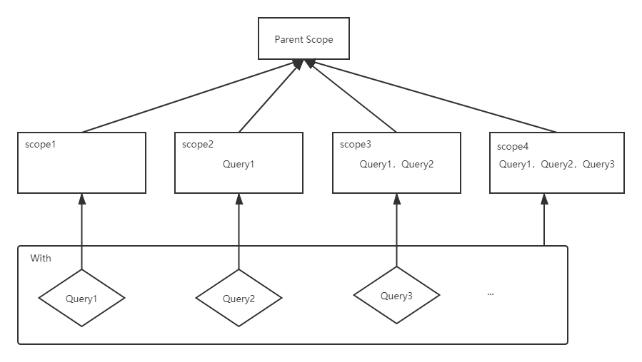

SQL语句的分析由`com.facebook.presto.sql.analyzer.Analyzer`完成。内部由`StatementAnalyzer`类进行具体工作，接下来介绍`StatementAnalyzer`的分析规则。

每个语句都会产生一个域（Scope）。Scope中主要记录其对应语句中的两种信息，一个是子查询（只记录With语句中的子查询），另一个是语句输出的关系的信息。另外，每个域会有一个父域（最外层语句除外），这个父域要么是一个本地域（LocalParent），要么是一个全局域（OuterQueryScope）。

虽然Scope记录两种信息，其中的子查询只是为With语句做的一个特殊处理，因为只有在With语句存在的情况下才会有子查询需要记录，所以Scope的真实用途是记录语句输出的关系的信息。关系就是一个表，一个查询的本质就是在不停把一些关系作为输入，这些输入被处理后输出另一些关系，Scope的父域决定着当前Scope有什么输入，而Scope记录着当前语句输出什么关系（不是每种语句都会输出关系，所以不是每个Scope都会有对应的关系输出）。举个例子，对于`select col1, col2 from table`语句，它会输出一个包含字段col1和col2的关系，所以其对应的Scope中会记录这个关系的RelationType，其父Scope是`from table`语句的Scope，`from table`输出关系`table`，select在关系table的基础上进行运算产生其输出关系。

接下来就从`Query`的解析说起。

`Query`如果包含`with`，那首先得解析with。with包含若干个子查询，而且先定义的子查询产生的关系可以供后定义的子查询使用，并且子查询不能生成相同名称的关系。因为with只定义查询，没有输出关系，所以它产生的Scope只包含子查询的信息（即NamedQuery），而不会产生关系（即RelationType）。with及其中子查询的Scope如图所示：

scope里的Query表示包含的NamedQuery。