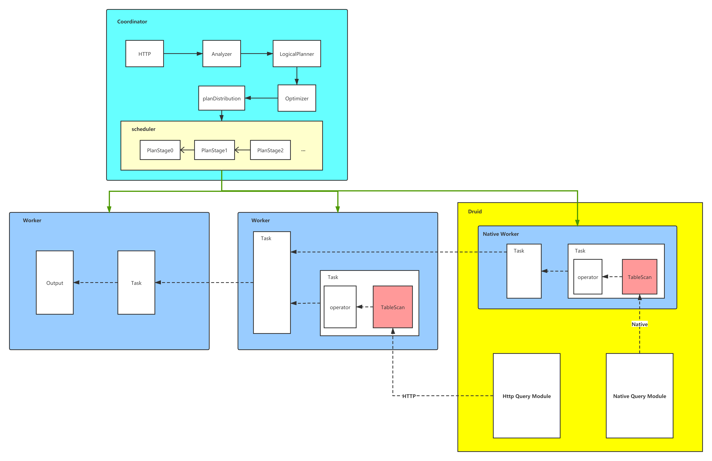

# Presto工作原理

presto是一个查询执行系统，其原理如下图所示：

Coordinator节点负责查询语句的分析，生成并优化查询计划，最终将计划分解为不同的stage，然后这些stage以task的形式分发到各个Worker节点进行执行。

Worker节点中执行的task是通过运行多个Operator完成工作的，task里的这些Operator相互连接组成一个pipeline，task里可能会有多个pipeline。查询的数据被一个task处理完成后会流向另一个task，而在task内部，数据是由一个Operator流向另一个Operator，其中每个Operator会对数据做一些特定的处理。

和Presto开发最相关的一个Operator是TableScan。它负责从数据源里读取数据以Page的形式传输给下游的Operator进行处理。所以`presto-zeus`插件的工作就是围绕怎么实现TableScan操作展开的。

# Presto zeus插件

一个Presto插件必须要提供以下功能：

1. 提供数据源的数据信息

   这个信息以表的方式提供，所以数据信息得包括表名以及其各个字段的名称及类型信息。

2. 读取数据源中的数据

   读取的数据会被组织成Page对象输出，一个Page相当于一个表数据的子集，每个Page会包含对个Block对象，而一个Block对应表中的一列。因为Page是可被序列化的，所以Operator之间的数据传输无论是本地内存还是远程网络均是通过Page完成的。

其他一些Presto插件中能够提供的可选功能（只列举部分功能）：

1. 自定义数据类型
2. 自定义函数
3. 查询计划优化

## 数据源信息

数据源相关的信息由presto-zeus插件中的`com.facebook.presto.druid.cluster`package中的类实现。

其中`datasource`子package中包含了获取Druid中DataSource相关的信息，包括DataSource的名称及各个字段的名称及类型，并存储于`DataSourceSchema`类型的对象中，由`SegmentSchemaManager`对象进行管理。

`table`子package中包含了获取zeus中的表信息并将其于Druid中的DataSource进行映射的功能。除了zeus的表映射，还提供了基于文件的表映射关系以及把Druid的DataSource作为一个表的映射关心。

## 数据源数据的读取

Druid中DataSource数据的读取涉及到Presto中的两个接口：`ConnectorSplitManager`和`ConnectorPageSourceProvider`。

`ConnectorSplitManager`由`DruidConnectorSplitManager`实现，其提供一系列的`ConnectorSplit`，一个split表示需要读取的源数据的一个子集，因为不同的split可以由不同的线程处理，所以split的数量决定了presto读取源数据的并发度。Druid中的数据是以segment为单位进行存储的，所以presto-zeus中`ConnectorSplit`的实现类`DruidConnectorSplit`会对应一个或多个segment。

因为`DruidConnectorSplit`与Druid的segment有对应关系，所有要生成split，首先需要获取到当前查询涉及到的所有segment的信息，以及其所在的druid节点。一个Druid节点下的segment会生成一个或多个split，生成的split数量则由相关配置决定。另外，根据Druid节点中是否嵌入Presto worker进程，生成的split的mode被分为两种：HTTP和Native。如果Druid节点中嵌入presto进程，则此节点下的segment生成的split的处理模式为Native；否则，split的处理模式为HTTP。不同之处在于HTTP通过网络交互对Druid的数据进行查询及传输，而Native可以直接在Druid进程中获取源数据。

split会被分发到TableScan Operator中进行处理，处理逻辑通过接口`ConnectorPageSourceProvider`实现，zeus插件中实现为`DruidConnectorPageSourceProvider`类。`DruidConnectorPageSourceProvider`接收split，然后通过split生成一个Page的迭代器，迭代器是根据split中的segment信息，mode信息，以及druid节点信息通过Druid的查询逻辑读取segment中的数据并封装成Page对象生成的。最后用这个迭代器生成一个`DruidConnectorPageSource`对象，TableScan Operator根据这个对象获取Page对象。

至此，获取源数据的功能已经完成。

## 自定义Type

每个Type都是接口`com.facebook.presto.spi.type.Type`的一个实现，每个实现需要对应一个Java类，这个类用于在内存中保存此类型的数据，另外还需要提供把数据写入Block的`BlockBuilder`接口的实现类。

## 自定义Function

函数分为三种类型：

- Aggregate
- Scalar
- Window

zeus插件中只实现了Aggrerate和Scalar两种类型的函数，前者为聚合函数，作用于一个数据集，后者为普通函数，作用于一个数据值。

具体实现参考`com.facebook.presto.druid.functions`下的实现类。

## 查询计划优化

Presto插件提供了有限的查询计划优化接口，可以对如下类型的计划节点进行操作：

- TableScanNode
- FilterNode
- ProjectNode
- LimitNode
- AggregationNode
- TopNNode
- UnionNode
- IntersectNode
- ExceptNode

目前zeus插件中只对`TableScanNode`、`FilterNode`、`ProjectNode`、`LimitNode`进行了优化，其中Filter下推是一个有效提高查询效率的优化步骤。

以上便是presto-zeus插件中的所有主要功能点。

# Druid presto插件

上面提到执行模式为Native的split是通过直接操作Druid进程中的对象进行数据获取的。Druid系统中实现的`ScanQuery`在功能上能很好的适用于通过split获取druid数据，http模式的split就是通过这类查询实现的。但是Native模式使用这个查询会有性能上的问题，主要原因是ScanQuery是通过把数据封装到List中返回的，这有两个弊端，一是对于原始类型的数据，必须要对其进行装箱操作（比如int转为Integer，long转为Long），这是个消耗内存并容易引发GC的操作；其次是这种方式不能很好的配合presto的pull形式的查询执行方式，也即需要数据时才对其进行读取的模式，而且数据是被一次读取到内存，因此也会很耗内存。

所以Druid的presto插件中重新实现了一个类似ScanQuery的LocalScanQuery，其通过迭代器的访问方式以及对原始类型的数据进行封装规避了上面提到的问题。

Druid presto插件的实现位于Druid项目的`extensions-contrib/presto-slot`子模块中。