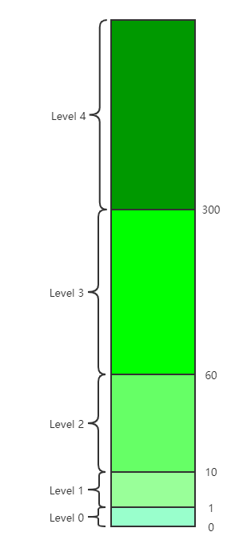

Presto中的查询最终会转化为任务，任务的执行是通过`TaskExecutor`进行调度执行的，为了保证任务之间能公平的执行，执行调度引入了多级队列的组织方式。

## Multi-level Split Queue

多级队列把任务分为多个级别，每个级别都有一个保存任务的优先队列，任务会根据其已经运行的时长被分配到对应等级的队列中。对于Presto的实现中共有5个级别，每个级别都有一个时长阈值，如下图所示：

图形右边的数字表示任务进入到某个Level的阈值（单位为秒），比如，当某个任务的总运行时长超过10s，并且没有到达60s，则此任务会被分配到Level2的队列中。

每个队列会有个统计量来记录这个队列中所有任务执行消耗的累计时长，这个统计值称为Level Scheduled Time，记为
$$
LevelTime_{level}
$$
多级队列结构通过维护各个Level之间的耗能来保证公平性，每个Level的耗能通过如下公式表示：
$$
LevelTime_{level} * multiplier^{level}
$$
其中multiplier是一个常数因子。首先，从公式可以看出，当某个level的累计时长越大，则公式对应的值也越大。保证公平性的方法是要求每个Level的耗能保持一致。根据公式，如果multiplier为1，表示对所有Level一视同仁，大家根据各自的运行累计时长来决定应该选取那个队列中的任务进行运行（累计时长最小的Level）；如果multiplier大于1，表示优先运行低Level队列中的任务，也即优先执行累计运行时长少的任务；如果multiplier小于1，表示优先运行高Level队列中的任务，也即优先执行需要长时间执行的任务。

如果把每个Level的队列看作汽车的话，则Level的耗能相当于骑车的油耗，并且Level低的队列相当于油耗小的骑车，而Level大的对应高油耗汽车，可以通过设置multiplier来表示我们的偏好。presto中multiplier的默认值为2，说明它比较偏爱耗时短的查询，也即通常的交互式查询。

理解了Presto对能耗的定义，也不难理解下面对Presto选择队列的方法的步骤：

首先获取各个Level中能耗的最大值：
$$
Level0TargetTime = max(LevelTime_{level} * multiplier^{level})
$$
（注意：代码中把这个最大值命名为`level0TargetTime`，其实名称中的0换为其他Level也可以，因为这个最大值表示当前所有Level应该达到的能耗值）

然后，获取能耗最大值与每个Level中的实际能耗的比率：
$$
ratio_{level} = \frac{targetScheduledTime_{level}}{LevelTime_{level}*multipiler^{level}}
$$
最后获取比率大的Level的队列：
$$
max(ratio_{level})
$$
确定队列之后就可以从队列中取出优先级最高的任务进行执行了。

需要说明的是，这里的获取最小比率的方式与获取耗时最小的方式是等价的，分子固定的话，分母肯定是越小，比率越大。

## 优先级

每个任务都有优先级属性，此属性指定了任务所在的Level，以及在Level队列中的优先级。如上所述，在那个Level由此任务的累计执行时长决定，而任务在队列中的优先级由任务在此队列中的累计执行时长决定。

当任务添加到一个空队列时，此队列的Level Scheduled Time需要设置为
$$
\frac{Level0TargetTime}{multipiler^{level}}
$$
这样队列的能耗能与最大能耗保持一致，防止新加入的任务持续占用资源，导致其他队列的任务无法执行。如果队列为空，可以假设此队列可能有一段时间没有增加能耗了，因此其能耗已经远低于其他队列的最大能耗，如果不对其能耗进行重置，则会在此队列补充能耗的很长一段时间内都会被选中执行，也就出现其他队列被饿死的情况。

如果队列中有任务，那么队列的每个任务执行完指定的时间配额后会向队列的Level Scheduled Time累加其实际的消耗的时长。如果任务的新增的耗时导致任务的Level变更，则任务只会向当前队列累加下一级Level与当前Level之间的阈值差大小的时长，多出来的耗时累加到下一个Level的Scheduled Time中。

任务在队列中的优先级通过任务在队列中的累计耗时表示。当某个任务添加到一个新队列时，其在队列中的初始耗时是基于队列中最近执行的任务的累计耗时计算的，这样也是为了防止新加入的任务持续执行，导致队列中其他任务饿死的情况。